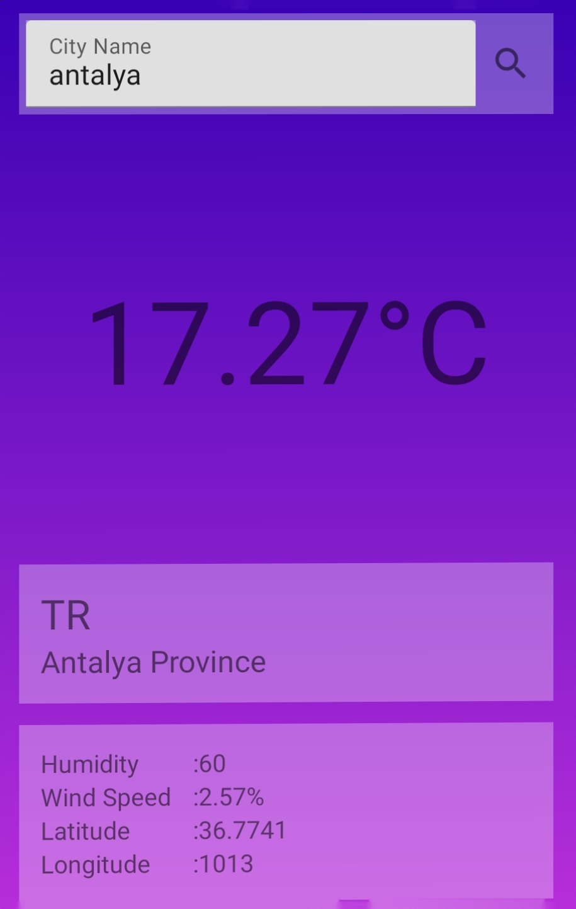

<h1 align="center">Weather App</h1>

<h4 align="center">An application where you can find out the weather by searching for cities and counties.</h4>

<h1 align="start">🛠 Project Features</h1>

- MVVM with Clean Architecture
- LiveData
- Navigation Component
- Retrofit 
- RxJava
- Gson 
- Kotlin Extensions
- Shared Preferences

## Screenshots

| Weather | 
|-------------------|
|  |

